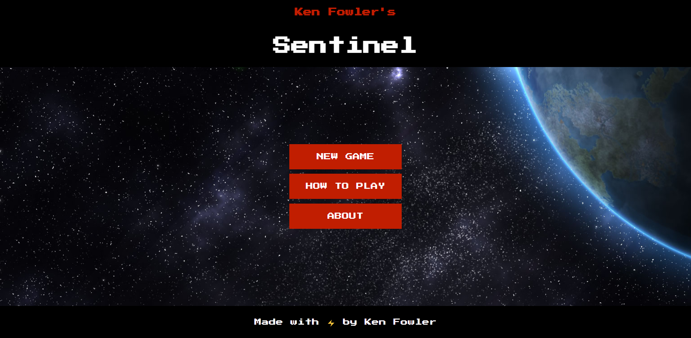

## Thanks for checking out Sentinel!

### To PLAY visit:

[sentinel@github.io](https://kenpfowler.github.io/)

### To DEVELOP the Sentinel project:

1. Download if you want your own copy or fork the repo if you want to contribute to the source
2. Use [lite-server](https://preview.npmjs.com/package/lite-server) to serve the files.
3. The game files are Scripts folder. Edit the TypeScript files and remember to build them to develop new content!

### Sentinel Screenshots

### About the Developer

Ken Fowler developed Sentinel as part of a Hackathon hosted by [Mintbean](https://mintbean.io/meets?sort=upcoming).
Visit Ken's [page](https://www.kennyf.ca/) or [LinkedIn](https://www.linkedin.com/in/kenpfowler/) to get in touch.
